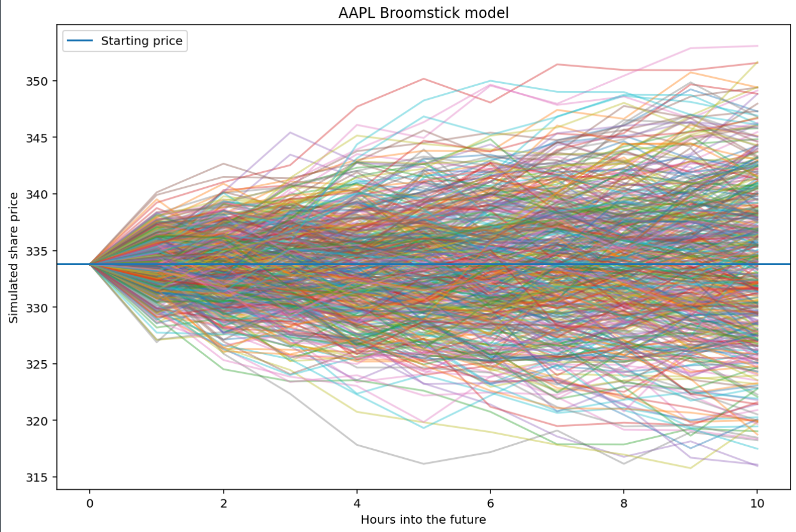
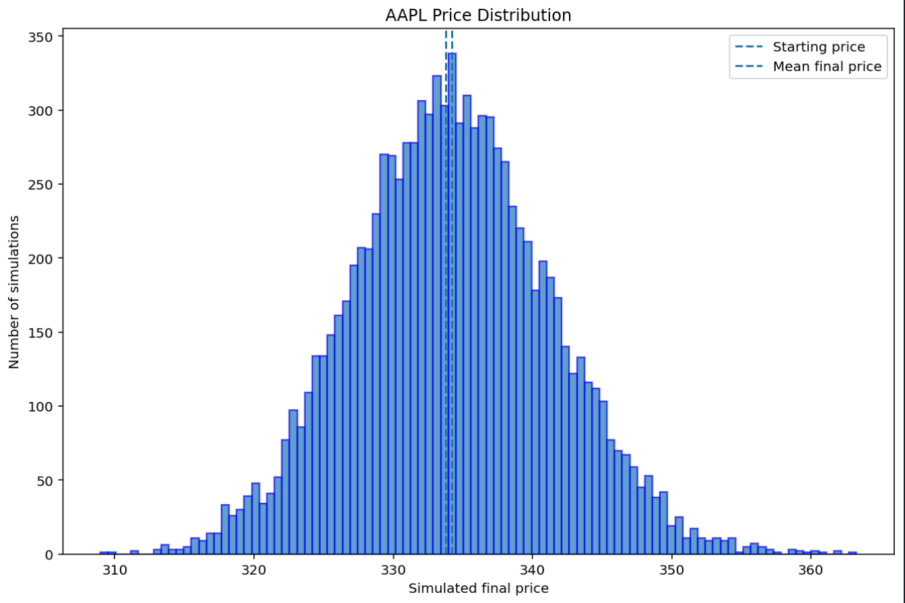

# Monte-Carlo-Backtest

# Overview 
Monte Carlo simulation is a computational method that uses repeated random sampling to model a range of possible outcomes. In this project, Monte Carlo simulation is used to generate potential future AAPL stock prices based on historical hourly returns and volatility. The project historical AAPL price data using yfinance and calculates hourly returns using pandas and NumPy. The historical mean return and standard deviation are then used as inputs for the simulation. Thousands of possible future price paths are generated, allowing the distribution of potential future prices to be analysed.



To better understand the Simulation we can use a normal distribution. The bell curve shows that most simulated outcomes are close to the expected outcome as well as showing; 

*Increasingly extreme outcomes becoming less likely, 
*Most simulations produce moderate price movements 
*Fewer simulations produce large positive or negative movements



This is useful because the purpose of Monte Carlo simulation is not to predict one exact future price, but to model a range of plausible outcomes and estimate their probabilities.

## Results 


## Technology-Used 
*Python - Coding language used for backtest
*numpy - library used for mathematical tools
*matplotlib - library used to display mathematical data using plots
*Pandas - library used to clean data imported from yfinance
*yfinance - library containing finacial data

## How-to-Use
Can either paste or download the raw code from the repository and download the imported libraries 

```bash
pip install pandas numpy matplotlib yfinance openpyxl
Then run:
```
```bash
python backtest(mcs).raw.y
```
this allows you to play with the code, use different numbers, plots or data as well access to the plots.

> **Large simulations take longer run.** Increasing the number of simulations, historical data, or holding periods will increase the processing time so if your data i'snt loading then give it time to load.

